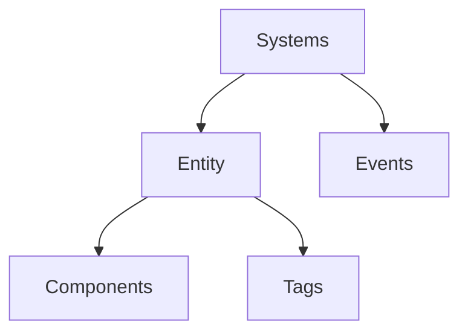
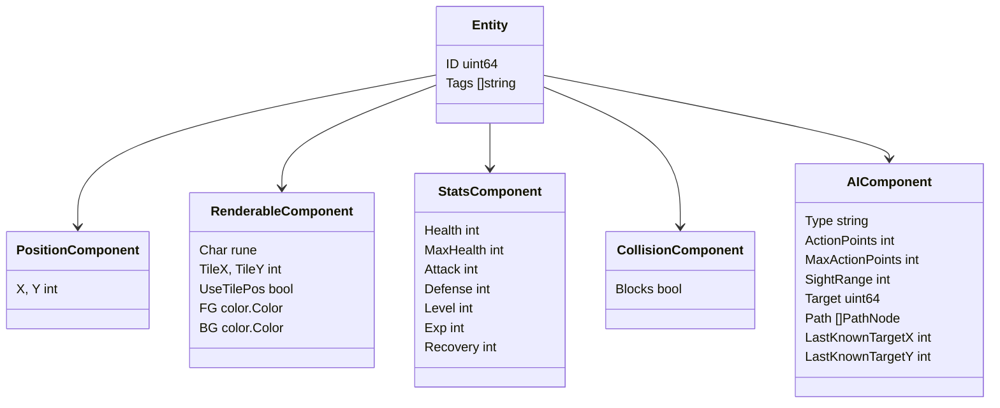
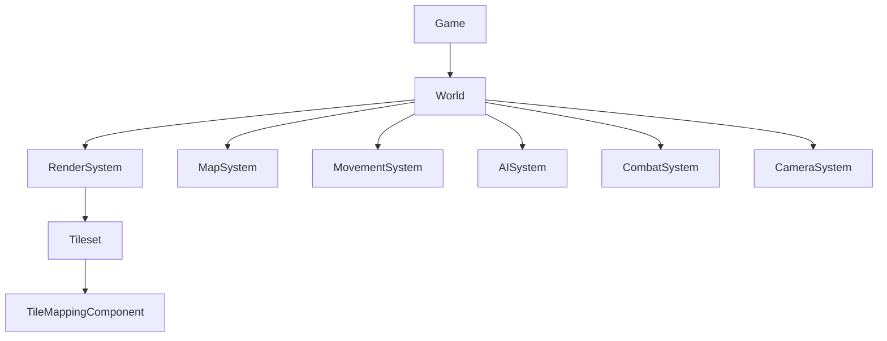
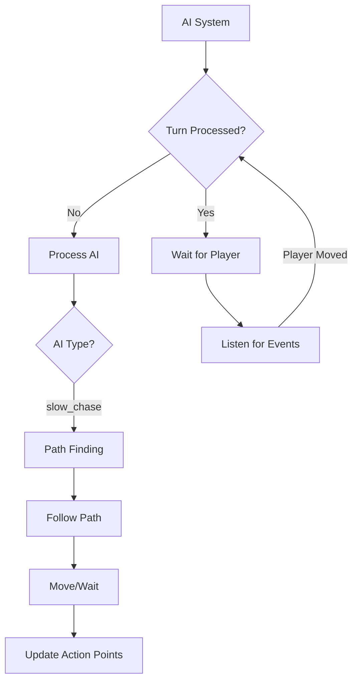
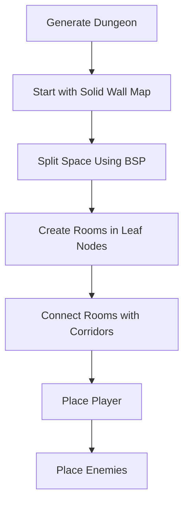
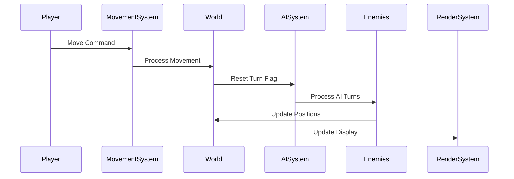

# Ebiten Roguelike

A Golang-based roguelike game using the Ebiten library. This game incorporates classic roguelike features such as turn-based combat, procedural generation, character progression, and eventually lighting and FOV systems.

## Features

### UI
- Uses the Code Page 437 tileset (Nice_curses_12x12.png)
- The UI is comprised of 3 areas:
  - Game screen: Square window top-left justified in the game window that displays the character and the local game world
  - Right panel: Displays character stats
  - Bottom panel: Shows game messages and logs

### Movement
- Arrow keys control the player character
- Movement is turn-based; when the player moves, enemies get their turn

## Architecture Overview

The game is built on an Entity-Component-System (ECS) architecture, which provides a flexible and modular way to build game mechanics.

### Entity-Component-System (ECS)

#### What is ECS?
- **Entities** are unique IDs that represent objects in the game (player, monsters, items)
- **Components** are data structures attached to entities (position, renderable, stats)
- **Systems** contain the logic that processes entities with specific components
- **Events** allow systems to communicate with each other

## Components

Components store data related to specific aspects of game entities.

### Key Components
- **Position**: Stores x,y coordinates for an entity
- **Renderable**: Contains information about how to draw the entity (character, tile, colors)
- **Stats**: Health, attack, defense and other RPG-style attributes
- **Collision**: Determines if an entity blocks movement
- **AI**: Controls NPC behavior like pathfinding and targeting

## Systems

Systems implement the game logic by processing entities with specific components.

### Key Systems
- **RenderSystem**: Handles drawing entities to the screen
- **MapSystem**: Manages map generation and map-related queries
- **MovementSystem**: Processes movement requests and collisions
- **AISystem**: Controls enemy behavior and pathfinding
- **CombatSystem**: Manages attacks and damage calculation
- **CameraSystem**: Controls viewport for map scrolling

## AI System Implementation

The game features an AI system for enemy behavior, currently supporting:

- **slow_chase**: AI that follows the player using A* pathfinding
- AI entities use action point system to control movement speed
- Line of sight detection determines if player is visible

## Procedural Generation

The game includes BSP (Binary Space Partitioning) dungeon generation:

## Turn-Based System

- Player moves trigger the turn cycle
- AI entities get their turns after the player
- Game waits for player input to continue the cycle

