# Ebiten Roguelike

A Golang-based roguelike game using the Ebiten library. This game incorporates classic roguelike features such as turn-based combat, procedural generation, character progression, an inventory system, and map transitions.

## Features

### UI
- Uses the Code Page 437 tileset (Nice_curses_12x12.png)
- The UI is comprised of 3 areas:
  - Game screen: Square window top-left justified in the game window that displays the character and the local game world
  - Right panel: Displays character stats
  - Bottom panel: Shows game messages and logs

### Movement
- Arrow keys control the player character
- Movement is turn-based; when the player moves, enemies get their turn

### Maps and Generation
- World map generation using cellular automata
- Dungeon generation using Binary Space Partitioning (BSP)
- Map registry system to track and transition between different maps
- Themed dungeons with customizable monster and item spawns

### Items and Inventory
- Collect and manage items in your inventory
- Item templates loaded from JSON for easy content creation
- Different item types (weapons, armor, potions)

### Combat System
- Turn-based combat with stats including attack, defense, and health
- Action point system for controlling movement speed
- Combat events and damage calculations

## Architecture Overview

The game is built on an Entity-Component-System (ECS) architecture, which provides a flexible and modular way to build game mechanics.

### Entity-Component-System (ECS)

#### What is ECS?
- **Entities** are unique IDs that represent objects in the game (player, monsters, items)
- **Components** are data structures attached to entities (position, renderable, stats)
- **Systems** contain the logic that processes entities with specific components
- **Events** allow systems to communicate with each other
- **Templates** define reusable configurations for entities loaded from JSON

## Components

Components store data related to specific aspects of game entities.

```mermaid
classDiagram
    class Entity {
        ID uint64
        Tags []string
    }
    
    Entity --> PositionComponent
    Entity --> RenderableComponent
    Entity --> StatsComponent
    Entity --> CollisionComponent
    Entity --> AIComponent
    Entity --> ItemComponent
    Entity --> InventoryComponent
    Entity --> EquipmentComponent
    Entity --> EffectsComponent
    Entity --> MapComponent
    Entity --> MapTypeComponent
    Entity --> CameraComponent
    Entity --> NameComponent
    Entity --> FOVComponent
    
    class PositionComponent {
        X, Y int
    }
    
    class RenderableComponent {
        Char rune
        TileX, TileY int
        UseTilePos bool
        FG color.Color
        BG color.Color
    }
    
    class StatsComponent {
        Health int
        MaxHealth int
        Attack int
        Defense int
        Level int
        Exp int
        Recovery int
        ActionPoints int
        MaxActionPoints int
        HealingFactor int
    }
    
    class CollisionComponent {
        Blocks bool
    }
    
    class AIComponent {
        Type string
        SightRange int
        Target uint64
        Path []PathNode
        LastKnownTargetX int
        LastKnownTargetY int
    }
    
    class ItemComponent {
        ItemType string
        Value int
        Weight int
        Description string
        TemplateID string
        Data any
    }
    
    class InventoryComponent {
        Items []EntityID
        MaxCapacity int
    }
    
    class EquipmentComponent {
        EquippedItems map[EquipmentSlot]EntityID
        ActiveEffects map[EntityID][]ItemEffect
    }
    
    class EffectsComponent {
        ActiveEffects []Effect
        PassiveEffects []Effect
        TemporaryEffects map[string]Effect
    }
    
    class MapComponent {
        Width, Height int
        Tiles [][]Tile
        Regions [][]int
        Visible [][]bool
        Explored [][]bool
    }
    
    class MapTypeComponent {
        MapType string
    }
    
    class CameraComponent {
        X, Y int
        Target uint64
    }
    
    class NameComponent {
        Name string
    }
    
    class FOVComponent {
        Radius int
        LightSource bool
        LightIntensity int
    }
```

### Key Components
- **Position**: Stores x,y coordinates for an entity
- **Renderable**: Contains information about how to draw the entity (character, tile, colors)
- **Stats**: Health, attack, defense, and other RPG-style attributes
- **Collision**: Determines if an entity blocks movement
- **AI**: Controls NPC behavior like pathfinding and targeting
- **Item**: Defines an item's properties like value, weight and type
- **Inventory**: Stores and manages a collection of items
- **Equipment**: Manages equipped items and their effects
- **Effects**: Tracks active, passive, and temporary effects on an entity
- **Map**: Contains the tile data for a map
- **MapType**: Specifies the type of map (worldmap, dungeon)
- **Camera**: Controls the viewport for map scrolling
- **Name**: Provides a display name for the entity
- **FOV**: Manages field of view and lighting properties

## Systems

Systems implement the game logic by processing entities with specific components.

### Key Systems
- **RenderSystem**: Handles drawing entities to the screen
- **MapSystem**: Manages map generation and map-related queries
- **MapRegistrySystem**: Manages multiple maps and transitions between them
- **MovementSystem**: Processes movement requests and collisions
- **PlayerTurnProcessorSystem**: Handles player input and turn processing
- **CombatSystem**: Manages attacks and damage calculation
- **CameraSystem**: Controls viewport for map scrolling
- **AIPathfindingSystem**: Manages pathfinding for AI entities
- **AITurnProcessorSystem**: Controls AI entity behavior and turn processing
- **EffectsSystem**: Handles all types of effects (passive, active, temporary)
- **InventorySystem**: Manages inventory operations like adding/removing items
- **EquipmentSystem**: Handles equipping/unequipping items and managing equipment effects
- **FOVSystem**: Manages field of view calculations and lighting
- **MessageSystem**: Handles game messages and logging

### System Interactions
The systems communicate through an event-based architecture:
- **Equipment Events**: `EventEquipItem`, `EventUnequipItem`, `EventEquipmentQuery`
- **Effect Events**: `EventEffects`, `EventRest`
- **Combat Events**: `EventCombat`, `EventDeath`
- **Movement Events**: `EventMovement`, `EventCollision`
- **UI Events**: `EventInventoryUI`

## Generation Systems

The game features multiple procedural generation systems for creating game worlds.

### Generation Components
- **WorldMapGenerator**: Creates the overworld map using cellular automata
- **BSP Dungeon Generator**: Creates dungeon levels using Binary Space Partitioning
- **Cellular Automata Generator**: Creates organic-feeling cave systems
- **Dungeon Themer**: Applies themes to dungeons from JSON definitions
- **Population System**: Populates dungeons with monsters and items based on themes
- **Entity Spawner**: Creates entities from templates
- **Template Manager**: Loads and manages entity/item templates from JSON files

## Data-Driven Architecture

The game uses a data-driven approach for content creation:

### Data Files
- **Monster Templates**: Define monster stats, appearance, and behavior in JSON
- **Item Templates**: Define items with properties, appearance, and effects
- **Theme Definitions**: Configure dungeon themes with specific monsters and items

## Turn-Based System

- Player actions trigger the turn cycle
- AI entities process their turns after the player
- Actions consume action points based on entity speed
- Combat and effects are resolved during turn processing
- Game waits for player input to continue the cycle

